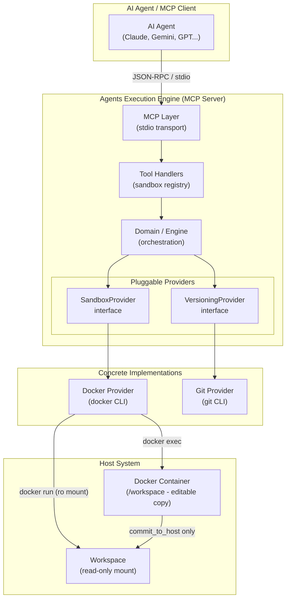
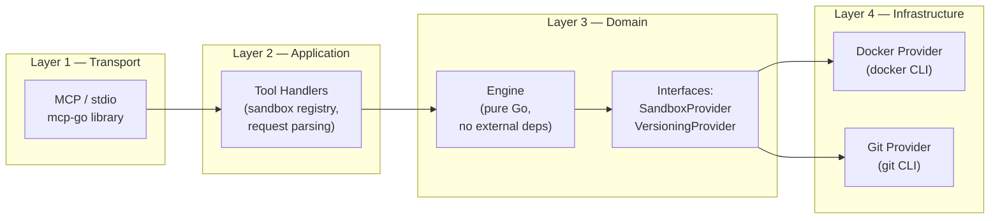
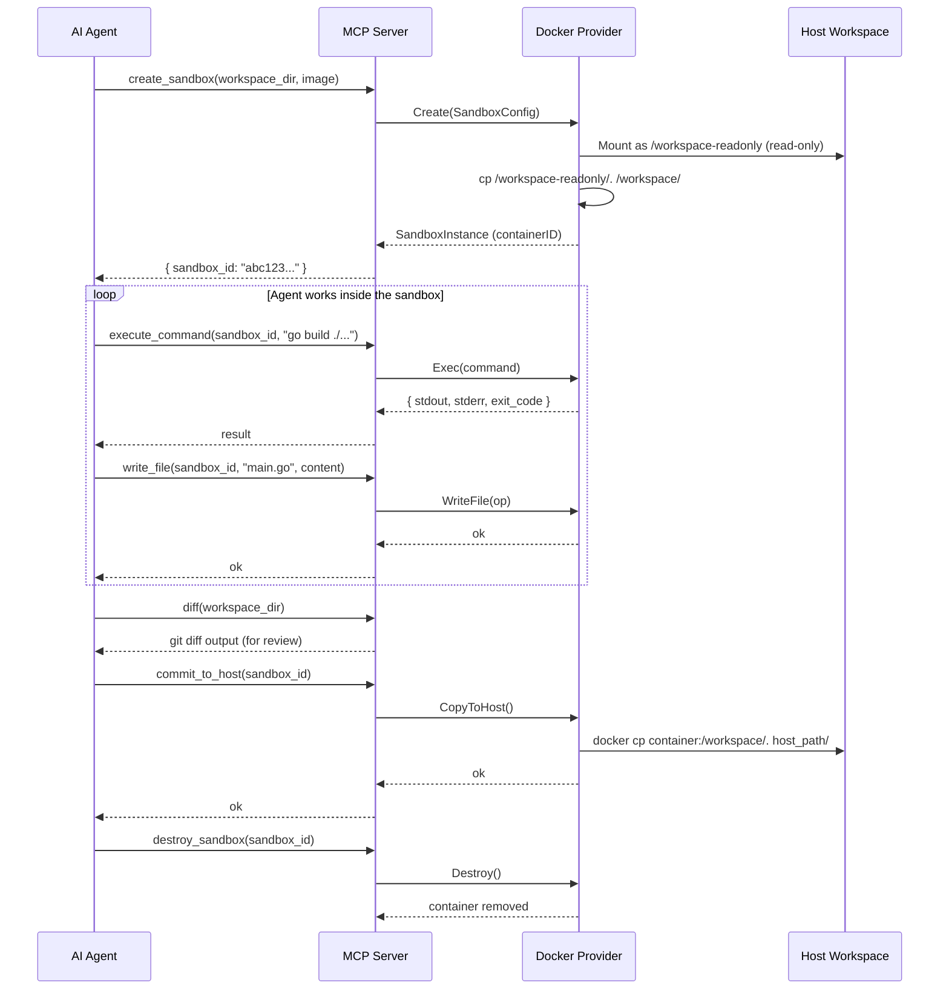
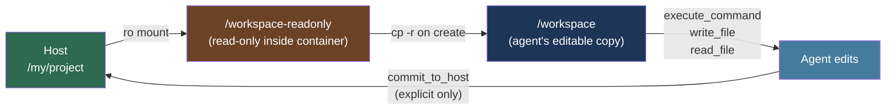

# Agents Execution Engine

> A lightweight, provider-agnostic **MCP (Model Context Protocol) server** that gives AI agents a safe, isolated environment to execute code — without ever touching the host filesystem directly.

---

## Overview

The **Agents Execution Engine** acts as a bridge between AI agents (e.g., Claude, Gemini, GPT) and a sandboxed execution runtime. Instead of letting an agent run arbitrary shell commands on the developer's machine, the engine routes all execution through isolated Docker containers. The host workspace is only modified when the agent explicitly chooses to commit changes back.

It exposes its capabilities via the **Model Context Protocol (MCP)** over `stdio`, making it compatible with any MCP-aware AI client (Cursor, Claude Desktop, Antigravity IDE, etc.).

---

## Key Features

| Feature | Description |
|---|---|
| **Isolated Execution** | Commands run inside Docker containers, never on the host directly |
| **Safe Workspace Handling** | Host directory is mounted **read-only**; the agent works on an isolated copy |
| **Explicit Commit** | Files only reach the host when `commit_to_host` is called |
| **Workspace Versioning** | Snapshot/restore/diff/log via Git (swappable to OverlayFS or others) |
| **Provider-Agnostic** | Swap Docker for Firecracker, gVisor, etc. by changing a single line |
| **MCP Native** | All tools speak JSON-RPC over stdio — plug-and-play with any MCP client |

---

## Architecture

### High-Level Overview



### Package Structure

```
agents-execution-engine/
├── cmd/
│   └── server/
│       └── main.go              # Entry point — wires providers, engine, and MCP server
│
└── internal/
    ├── domain/                  # Core abstractions (no external dependencies)
    │   ├── engine.go            # Engine struct — central orchestrator
    │   ├── sandbox.go           # SandboxProvider & SandboxInstance interfaces
    │   ├── versioning.go        # VersioningProvider interface
    │   └── command.go           # Command, CommandResult, FileOperation types
    │
    ├── mcp/                     # MCP adapter layer (only package using mcp-go)
    │   ├── server.go            # MCP server setup & tool registration
    │   └── handlers/
    │       ├── handlers.go      # Shared handler state & helpers
    │       ├── sandbox_create.go
    │       ├── sandbox_exec.go
    │       ├── sandbox_destroy.go
    │       ├── sandbox_file.go
    │       ├── versioning.go
    │       └── prompts.go       # agent_rules prompt
    │
    ├── sandbox/
    │   └── docker/              # Docker implementation of SandboxProvider
    │       ├── provider.go      # Container creation (read-only mount + copy)
    │       └── instance.go      # Exec, WriteFile, ReadFile, ListFiles, Destroy, CopyToHost
    │
    └── versioning/
        └── git/                 # Git implementation of VersioningProvider
            ├── provider.go
            ├── init.go
            ├── snapshot.go
            ├── diff.go
            ├── restore.go
            └── log.go
```

### Layered Architecture



The architecture deliberately enforces a **dependency rule**: each layer only imports the layer directly below it. The `domain` package has **zero external dependencies** and is the heart of the system.

---

## MCP Tools Reference

### Sandbox Tools

| Tool | Required Args | Optional Args | Description |
|---|---|---|---|
| `create_sandbox` | `workspace_dir` | `image`, `memory_limit`, `cpu_limit` | Creates an isolated Docker container with the workspace mounted read-only |
| `execute_command` | `sandbox_id`, `command` | `workdir`, `timeout_seconds` | Runs a shell command inside the sandbox |
| `write_file` | `sandbox_id`, `path`, `content` | — | Writes a file to the sandbox workspace |
| `read_file` | `sandbox_id`, `path` | — | Reads a file from the sandbox workspace |
| `list_files` | `sandbox_id` | `path` | Lists files in a sandbox workspace directory |
| `destroy_sandbox` | `sandbox_id` | — | Destroys the container and releases all resources |
| `commit_to_host` | `sandbox_id` | — | Copies modified files back to the host. Only call after user approval |

### Versioning Tools

| Tool | Required Args | Optional Args | Description |
|---|---|---|---|
| `snapshot` | `workspace_dir`, `message` | — | Creates a Git commit as a restore point |
| `diff` | `workspace_dir` | — | Shows changes since the last snapshot |
| `restore` | `workspace_dir`, `snapshot_id` | — | Resets the workspace to a previous snapshot |
| `log` | `workspace_dir` | `limit` | Lists snapshot history |

### MCP Prompts

| Prompt | Description |
|---|---|
| `agent_rules` | Returns mandatory rules that instruct the agent to use the sandbox instead of running local commands |

---

## Sandbox Lifecycle



---

## Workspace Safety Model



The host is **never modified** by execution or file operations — only by an explicit `commit_to_host` call, giving the user full control over when changes land.

---

## Getting Started

### Prerequisites

- [Go 1.22+](https://go.dev/dl/)
- [Docker](https://docs.docker.com/get-docker/) (running)
- [Git](https://git-scm.com/) (for versioning tools)

### Build

```bash
go build -o agent-server ./cmd/server
```

### Configure with your MCP Client

Add the server to your MCP client configuration (e.g., `mcp.json` or Claude Desktop config):

```json
{
  "mcpServers": {
    "agents-execution-engine": {
      "command": "/path/to/agent-server"
    }
  }
}
```

The server communicates over **stdio** — no ports, no network setup required.

---

## Extending the Engine

### Swapping the Sandbox Provider

To replace Docker with a different runtime (e.g., Firecracker micro-VMs, gVisor), implement the [`SandboxProvider`](internal/domain/sandbox.go) interface and update a single line in [`main.go`](cmd/server/main.go):

```go
// Before
sandboxProvider := docker.NewDockerProvider()

// After — your custom provider
sandboxProvider := firecracker.NewFirecrackerProvider()
```

### Swapping the Versioning Provider

To replace Git with OverlayFS or another backend, implement the [`VersioningProvider`](internal/domain/versioning.go) interface:

```go
// Before
versioningProvider := git.NewGitProvider()

// After
versioningProvider := overlayfs.NewOverlayFSProvider()
```

---

## Dependencies

| Package | Purpose |
|---|---|
| [`github.com/mark3labs/mcp-go`](https://github.com/mark3labs/mcp-go) | MCP server implementation & stdio transport |
| `os/exec` | Docker and Git CLI invocation (no heavy SDK dependencies) |
| Standard library | Everything else |

> The engine deliberately avoids importing Docker SDK or Git libraries, keeping the binary lean and portable. It only shells out to the `docker` and `git` CLIs.

---

## License

This project is licensed under the MIT License - see the [LICENSE](LICENSE) file for details.

